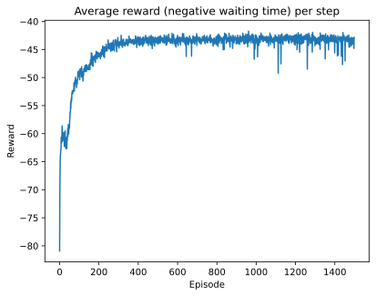

# Train Operations Simulator
Python code to simulate the movement of trains in a railroad operation and solve the single track scheduling problem using a Reinforcement Learning actor-critic model.

The simulation can output train graphs and also aggregated statistics about cycle times and segment utilization.

## Example outputs

*48 hr train graph with 5 highlighted trains and 2 other circuits*

*Utilization percentages per track segment*

*Model training output: average reward per episode*

## Instructions

1. The input data is filled in a spreadsheet (see [*Input example*](Input%20example.xlsx)). This file contains the list of circuits, stations and itineraries per circuit.
2. Training and inference is done through the [*main.py*](main.py) script or [*main.ipynb*](main.ipynb) notebook (pick either one). For doing a quick benchmark, you can run the inference only, without a model. This will run a simulation giving the first train that reaches a segment priority over the segment (no optimization).
3. Additional parameters are filled in the [*params.py*](params.py) file.
4. Output plots in the training phase are saved to the *training_plots* folder. Prediction/inference plots are saved to the *plots* folder. These will be created automatically if they do not exist.

## Requirements

The model has been developed and tested with Python 3.12. For libraries see [*requirements.txt*](requirements.txt).
The RL model training will use GPUs if available, but it's not strictly necessary.

## Use cases and current scope

The simulation is capable of projecting the movemement of trains using fixed travel and process times from the input spreadsheet. Adding stochastic times is feasible, but not yet implemented.

The trains starting positions are randomized, as it simplifies the code for environment initialization. Having finer control over the starting positions is feasible, and would open up new use cases.

**The current use case is estimating waiting times per cycle, and segment utilization**. Adding stochastic times would allow validating buffer times and estimating service level. Adding configurable starting positions would allow real-time scheduling for ongoing operations.

## Reinforcement Learning model

The purpose of the RL model is to **minimize the total waiting time** of all train circuits. The variables that it can control are the decisions of which train to give priority over a single track segment.

Each time the simulation encounters a situation where a train is ready to enter a segment, but there is another one that is projected to enter from the opposite end before the first one has left, there is a conflict over which train has priority. The simulation stops and waits a decision from the RL model.

All events that happen in the simulation between two of these decisions consitutes an environment **step**. In this way we discretize the simulation time, and we only care about the state of the environment at the end of each step.

The **action space** for the RL model is binary. The value of 1 means the first train that arrived at the segment is given priority.

The **reward** is the negative of the sum of waiting times for all trains during the last step.

The **state vector**, which represents the state of the environment at the end of each step, has 11 + 2*(number of trains) features, and an extra component that indicates whether the simulation has ended. These features, in general terms, are:
1. Segment ID in dispute, circuit IDs of the decision trains
2. Positions of the decision trains in their circuits in relation to other trains
3. Position of all trains in operation, measured as a proportion of the total cycle time
4. Whether each train is waiting

### Feature extraction

This state vector is further processed by adding splines over the train position features, to detect non-linear relationships. During the forward pass, further features are extracted: 
1. The differences in position between all trains of the same circuit
2. The differences in position between trains that are the head of a circuit
3. The sum of splines for each circuit
4. Splines of the head train of each circuit
5. Splines for the decision trains

### Neural network architecture

The neural network follows an actor-critic architecture, with initial shared layers and separate heads for each output.

The actor output is a sigmoid that models the action probability, and the critic output is linear, to model the state value function.

The number of parameters depends on the number of trains, circuits and segments, and the hyper-parameters that control hidden layer sizes, embedding sizes and spline knots.

*Neural net architecture for the example input (9 trains, 3 circuits, 15 segments). Total 62K parameters.*

### Hyper-parameters

The training hyper-parameters are set in the [*params.py*](params.py) file.

The objective function combines the critic loss, the actor loss and an entropy term to encourage exploration. The weight of the critic and entropy terms can be adjusted. **Exploration is very sensitive to the entropy weight**, so it probably needs tuning for your particular rail network. Since giving the first train priority is a good heuristic, the model often converges to outputting 1 if the entropy weight is too low. Try adjusting the weight so that the action probability isn't too high, for example, 0.9.

Adjusting the **hidden layer sizes and embedding sizes** is usually also necessary, depending on the number of trains and segments in your operation.

The discount rate gamma for discounting the future rewards starts by default at 0.95 and increases to 0.998 after 3/4 of the episodes. The rewards are accumulated over an **N-step return**, where N is the number of simulation steps per gradient step. The default N is 5, which together with the terminal gamma of 0.998 gives a discount factor of 0.998^5 ~ 0.99 for the value of the next state after the 5 steps, which is a common value in RL problems.

The batch size for each gradient step is set to the number of threads times the number of replicas per thread. The default replicas per thread is 32. The testing of the model was done with 12 threads, which yields a batch size of 384.

The episodes end after a fixed number of gradient steps, by default 44. New environments with random starting positions replace the full batch after each episode. This is done so that the RL algorithm has exposure to both chaotic starting points and regular operations.

## Contributing

There are many details in the model that can be refined, and also opening up new use cases, such as real-time scheduling or stochastic simulations. Please open an issue in the repo for reporting bugs or suggestions.

## License

This project is shared under the MIT License. See the LICENSE file for more details.